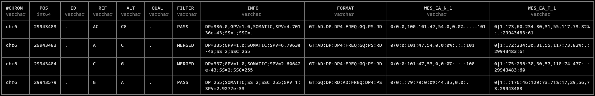

# mnp-merge-nf
<p align="center">
  
</p>

## Introduction
### Motivation
Single-nucleotide polymorphism (SNP; or variant, SNV) detection and calling is a foundational component of identifying driver, prognostic, and clinically-actionable gene targets in cancer. However, diverse variant calling tools have led historically to misannotated variants, as explored by a 2021 [*Cancer Research* article by Srinivasan et al.](https://doi.org/10.1158/0008-5472.CAN-20-2151). They used pan-cancer data from The Cancer Genome Atlas (TCGA) to identify 12,141 incorrectly annotated variants. In particular, these consisted of variants called as independent SNVs when they should have been called as complex multi-nucleotide variants (MNVs/MNPs) instead. In some cases, you may get a duplicate call for the associated protein-level change; however, these occurrences are most impactful when they lead to a different call in the amino acid residue and are not caught and fixed.

The downstream consequences of misannotation may be severe both for interpreting variants in the academic setting and for planning therapeutic interventions in the clinical setting. Srinivasan et al. cite *BRAF V600* and *KRAS G12* as two of the more prominent clinically-relevant variants that were frequently misannotated. Resources like [OncoKB (here for BRAF)](https://www.oncokb.org/gene/BRAF) show the reported differences in mutation effect, oncogenicity, and drug response for variants at these positions. The authors conclude that the urgent best-practice approach is to incorporate an MNV merging step in sequencing and variant calling pipelines.

### Merging MNVs/MNPs
[Sentieon](https://github.com/Sentieon/sentieon-scripts/tree/master/merge_mnp) has since made available an open-source workflow and set of scripts for identifying and merging MNPs. This involves two main steps:
* Including phase information in variant SNP VCF files. Some variant callers like modern versions of Mutect2 now include this information. Others, especially older and legacy callers like VarScan2, do not. Sentieon recommends using [whatshap](https://whatshap.readthedocs.io/en/latest/index.html) for unphased VCFs.
* Identifying neighboring SNPs that are both in-phase (occur together on the same reads as part of the same haplotype) and that are located within the same codon (e.g., they would lead to misannotation of the amino acid change).

`mnp-merge-nf` integrates both steps into a Nextflow pipeline and provides a modified version of Sentieon's `merge_mnp.py` script (`merge_mnp_varscan.py`) which supports VarScan2's non-standard VCF file format.

## Requirements
* [Nextflow](https://training.nextflow.io/latest/)
* [Docker](https://www.docker.com/)

Note: Nextflow can also be installed and run with [Pixi](https://pixi.prefix.dev/latest/), e.g.:
```bash
pixi add nextflow
pixi run nextflow run [...]
```

## Usage
### Set-up
You will need both `params.yaml` and `samplesheet.csv` files. Templates are available at [templates/params.yaml](templates/params.yaml) and [templates/samplesheet.csv](templates/samplesheet.csv). 

**params.yaml**: specify a reference genome FASTA+FASTA index, a `codons.txt` (see [instructions from Sentieon](https://github.com/Sentieon/sentieon-scripts/tree/master/merge_mnp#example-usage---merging-only-variants-within-the-same-codon)), and an output directory, example:
```bash
reference_fasta: "ref/GRCh38.d1.vd1.fa"
reference_fasta_fai: "ref/GRCh38.d1.vd1.fa.fai"
codons: "ref/codons.txt"
outdir: "data/merged"
```

**samplesheet.csv**: specify a sample_id and accompanying files (BAM+index and VCF), example:
```bash
sample_id,normal_bam,normal_bai,tumor_bam,tumor_bai,vcf
WES_EA,data/WES_EA_N_1.bwa.dedup.bam,data/WES_EA_N_1.bwa.dedup.bai,data/WES_EA_T_1.bwa.dedup.bam,data/WES_EA_T_1.bwa.dedup.bai,data/varscan2/WES_EA.snp.Somatic.hc.vcf.gz
```

> [!NOTE] 
> Before running, double-check that the sample names in the VCF file are identical to the `@RG` read group sample names in your BAM files. Otherwise, whatshap will run but will not phase any variants.

### Running
Run in the form of either:
```bash
nextflow run main.nf -profile docker -params-file templates/params.yaml --samplesheet templates/samplesheet.csv
```
OR
```bash
pixi run nextflow run main.nf -profile docker -params-file templates/params.yaml --samplesheet templates/samplesheet.csv 
```

`mnp-merge-nf` will output merged VCFs as compressed `vcf.gz` files. Merged variants will be marked as `FILTER = MERGED`, as shown in the example below, and may be filtered out for downstream purposes.



In this example, 3 variants are in-phase (sharing the tag `PS: 29943483`). However, only 2/3, at positions 29943483 and 29943484, are adjacent and within the same codon. Therefore, these two are merged (`FILTER = MERGED`) into a single two-nucleotide variant record at position 29943483. This new merged variant and the third unmerged variant at position 29943579 would be retained with a `FILTER = PASS` filter.

If the two SNPs hadn't been merged and had been left misannotated: in this case, the codon reference sequence is ACG and encodes amino acid T/Thr. Downstream variant annotation (e.g., with VEP) would likely treat these independently as CCG (P/Pro) and AGG (R/Arg) if undetected and unfixed.

## Example data
Scripts and instructions for how to download and work with example data from the [SEQC2 Consortium](https://sites.google.com/view/seqc2) have been included in [data/README.md](data/README.md). Briefly:
* Download the reference genome data ([instructions](ref/README.md), [script ref/01-reference_download.sh](ref/01-reference_download.sh))
* Download the sample BAMS ([instructions](data/README.md), [script data/01-data_download.sh](data/01-data_download.sh)) 
* Run VarScan2 ([instructions](data/README.md), [script data/02-run_varscan.sh](data/02-run_varscan.sh))
