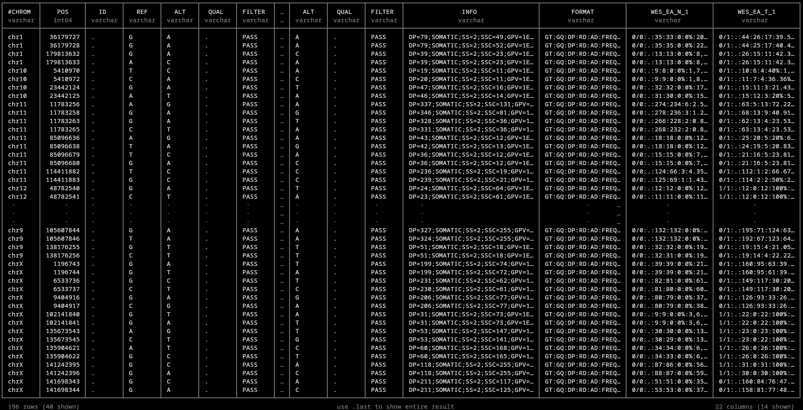

# VarScan2 
## File outputs
You should expect to see a large number of output files like this:

```bash
WES_EA.indel.vcf
WES_EA.normal.mpileup
WES_EA.snp.Germline.hc.vcf
WES_EA.snp.Germline.vcf
WES_EA.snp.LOH.hc.vcf
WES_EA.snp.LOH.vcf
WES_EA.snp.Somatic.hc.vcf
WES_EA.snp.Somatic.hc.vcf
WES_EA.snp.Somatic.vcf
WES_EA.snp.vcf
WES_EA.tumor.mpileup
```

The `.mpileup` files are intermediate files from samtools and may be discarded unless necessary for troubleshooting or other downstream purposes. The rest break down all of the called variants on the following basis:
    * Indels
        - We only further processed the SNPs because this is pipeline is oriented toward SNP merging, so there is only one indel file
    * SNPs
        - Germline vs. Somatic vs. LOH called variants
            - All vs. high-confidence (hc) variants

## How many SNPs might we expect to merge?
To answer this question, we might want to look at how many SNPs are both:
    1. On the same chromosome and
    2. Within a certain short distance of other called SNPs (say, +/- 2 base pairs)

We will also eventually want to know whether any neighboring SNPs are in-phase, or always expressed together on the same reads (and therefore representing a single mutation event vs. multiple independent SNPs). There are many ways to look at this. Since this is a CLI-oriented workflow, we'll use [DuckDB](https://duckdb.org/install), a powerful SQL database management system. If you want to follow along and install DuckDB, you can run the optional script here:

```bash
bash optional-snp_quickcheck.sh
```

If you don't have DuckDB, that's okay. Here's what it looks like:



So it looks like there are 196 candidate variants that may benefit from merging, though we'll need to take phase information into account as well.
